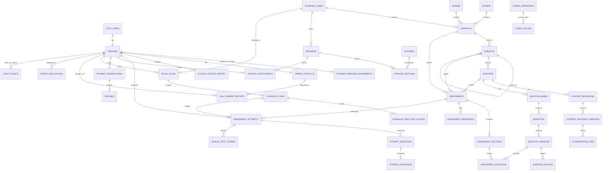

# Database Entity Relationship Diagram

This ERD is the implementation companion to [Database Design](09-database-design.md). It shows ownership and the main cardinalities; version/audit support columns are omitted for readability.

## Critical constraints

- One `profiles` row per Supabase Auth user.
- At most one current Account Manager assignment per student.
- At most one active parent contact and one active study plan per student.
- Package, entitlement, plan, and curriculum are tied to an academic year.
- Published questions/resources are versioned; attempts retain exact snapshots.
- One parent daily report per student per scheduled date.
- Razorpay provider IDs and webhook event IDs are unique for idempotency.
- Audit events are append-only and expire after one year through a privileged retention job.

